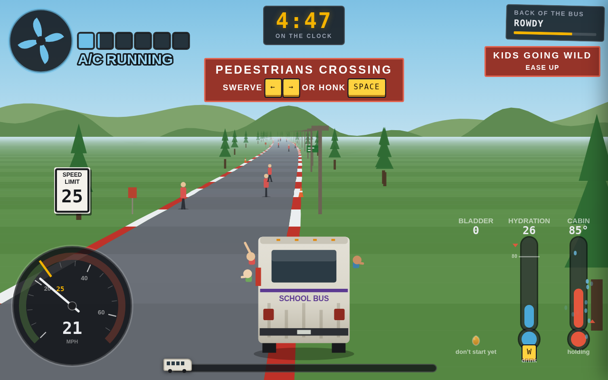

# BUS SUB

A substitute driver, a broken-down school bus, a hot afternoon and a five-minute deadline.
Drive the route out of the school and back again while the bus drifts right, the brakes lag,
the A/C keeps dying, the kids get louder, and every sip of water brings you closer to the
moment you can't hold it any more.

**Play:** https://justbost.com/bus-sub/ (desktop browser, keyboard)

## Controls

| key | does |
|---|---|
| ↑ | throttle |
| ↓ | brake (there's lag; pump it) |
| ← → | steer |
| Space | start the run / horn (clears pedestrians and cutters, winds the kids up) |
| W | drink water |
| S | smack the A/C back to life |
| M | mute |
| R | restart |
| ` or click the clock | tuning bench (76 parameters, saved to localStorage) |

## Running it locally

No build step. It's one HTML file plus the sound clips in `snd/`. Serve the folder with any
static server, e.g. `python3 -m http.server`, and open it. Opening `index.html` straight from
disk also works in most browsers.

## What's here

- `index.html` — the whole game: CSS, markup and a single canvas renderer in plain JS.
- `snd/` — 20 MP3 clips (engine, music loop, crowd, fan, horn, brakes, pothole, train crossing, nine yells).
- `screenshot.png` — portfolio thumbnail (1280×800).

All asset paths are relative, so the game runs from any subpath.

## Deployment

Served by GitHub Pages from `main` / root at `https://justbost.com/bus-sub/` (the org site owns
the `justbost.com` domain; this repo has no CNAME). It was never on Netlify, so there's no
redirect to maintain.

## Verification

_Recorded at handoff, 2026-09-25._

- **Local, served under `/bus-sub/`** (Chromium, 1280×800): title card rendered; Space started
  the run; holding ↑ for 9 s moved the progress bar to 2.2% and the clock to 4:47; all 20
  sound clips returned 200 from `/bus-sub/snd/…`; no JavaScript errors. The only console error
  was the Google Fonts stylesheet being unreachable from the test sandbox.
- **Live:** see the section below.
